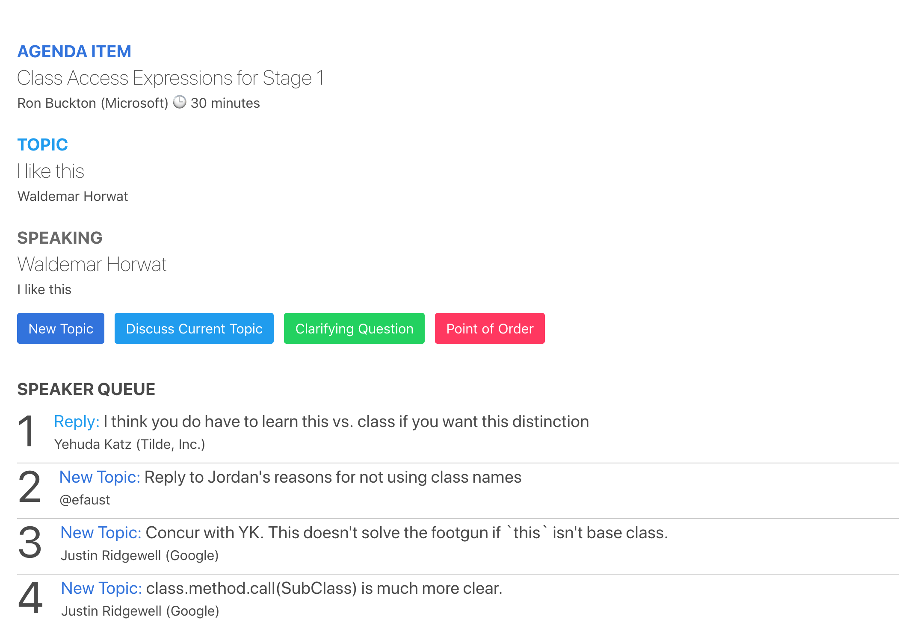

# How to participate in meetings

TC39 meetings can get quite large. Sometimes we can have more than 60 people in a room, plus people
joining in remotely. Because of this, we have some practices put in place to make things more
managable, and make it possible for everyone to be heard!

## Guidelines

We have a [Code of Conduct](https://tc39.github.io/code-of-conduct/). Please read through the CoC
and remember to be respectful and considerate when participating in meetings. It is key that we keep
our discussion friendly, patient, and considerate as we are discussing proposals.

## Consensus

The committee operates using a model of complete consensus. This means that everyone has to agree in
order for a proposal to move forward in the stages. This is something that the committee feels
strongly about, and in past cases a single person disagreeing with a proposal has helped us rework
and improve proposals rather than letting them through to the next stage. As such, breaking with
consensus can be very disruptive and shouldnt be done unless necessary. For this reason you will
often see delegates say that they might not like a solution very much, but will not break consensus
unless other delegates are also not happy with a solution. Breaking consensus alone is a very strong
signal.

If you find that you unhappy with a proposal, try to think of a way to help the proposal address the
issues you see with it, and articulate them. What are the limitations? Are there studies that the
champions can do to help their case? What sort of improvements are needed? Have requirements been
missed? Try to move the discussion in a positive direction!

## Tools for Participation

We have a few tools that help us facilitate communication. They are as follows:

### IRC

_Purpose_: A place for delegates to ask questions in a non vocal manner, useful if you need
definitions or something similar!

_How to use_:
We use the #tc39-delegates channel on Freenode. You can find instructions for joining
[here](https://freenode.net/kb/answer/chat)

### [Queue](https://tcq.app/)

_Purpose_: To organize people's responses to a topic, and make sure everyone is heard

_How to use_:

When the meeting starts, a link to the tcq meeting will be added to the delegates IRC channel topic.
At the top you will see "Agenda" and "Queue".

If you are interested in knowing what is coming up, you can take a look at the agenda page. However
this is more useful for chairs, who can add agenda topics that are coming up next, and their
associated time box.

During Presentations, if you notice something a speaker says that you want a clarification of, or to
make a comment, you can do this in the "Queue". There are three options: new topic, clarifying
question, and point of order. It looks something like this:

At the top we have the Agenda item that is being discussed, followed by the queue item that is being
discussed. After that, we have a bunch of buttons!

If you are speaking, then you will have the option to say that you are done speaking.

As for the other three buttons!

A clarifying question is used when you want to continue the current topic and ask something about
it. For example, if someone uses an example that doesnt make sense to you, you can ask them to
clarify what they meant. Clarifying questions will be added in the order they were entered into the
queue

A point of order is used to immediately bring up a point. For example, if a note taker
has been kicked from the notepad, and needs people to pause for a moment, they might use a point of
order, saying that the note taking service is down. This is added to the top of the queue, and will
be the next thing addressed

A new topic breaks with the current topic, and starts a new thread to which clarifying questions
might be added. New topics are ordered by when they are added to the queue

### [Timebox](https://timebox.now.sh/)

_Purpose_: To ensure that topics are timeboxed and that we do not go over time talking about a
subject

_How to use_:

The timebox is used primarily to make sure we are on time with our topic. You can visit this page if
you want to see how much time is left for a topic. If we go over time, let us know so that we can
vote on if a topic needs more time!

### [Etherpad](http://etherpad.org/)

_Purpose_: To record the meeting so that it can be shared with the public, and referenced in the
future.

_How to use_:

For every day of the meeting we have a new Etherpad URL that is shared in the delegates IRC channel.

If you are a note taker, please take a look at our [how to be a note taker]() documentation

If you are not a note taker, unless you need the etherpad to follow the conversation (for example the audio
quality is bad on google hangouts) Please do not open the ether pad during the meeting! Note takers
can be booted from the etherpad if there are two many people there, and this can disrupt note
taking.

### [Google Hangouts](https://hangouts.google.com/)

_Purpose_: To allow remote TC39 delegates to participate in the meeting

_How to use_:

We use Google hangouts to faciliate remote attendance. To attend, use the link posted at the top of
the TC39 IRC delegates channel. If you are not familiar with google hangouts, take a look at their
documentation
[here](https://support.google.com/hangouts/answer/3110347?co=GENIE.Platform%3DDesktop&hl=en)

## Tips

- if you are new and not sure what to do, consider becoming a note taker!
- talk to people during the meetings, they can help you establish context for anything that seems
  strange
